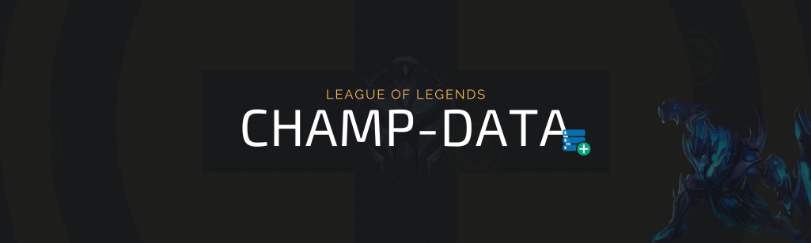
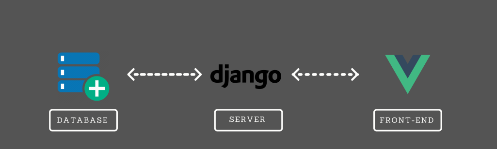

# Champion Feedback

## Description
The project aims to allow the user to leave feedback on league of legends game characters with rating and comment. In addition to being able to view other feedbacks made previously.

## Used Technologies
- Python
- Django
- Django Rest
- Vue.js

### Communication

For the project, some technologies were used, and their communication is done in a way that: For the frontend it was using Vue.js which communicates with Django Rest in the backend by sending and receiving data, data that the backend receives from the database to send to the frontend in the same way as receiving data from the frontend sends to the database.